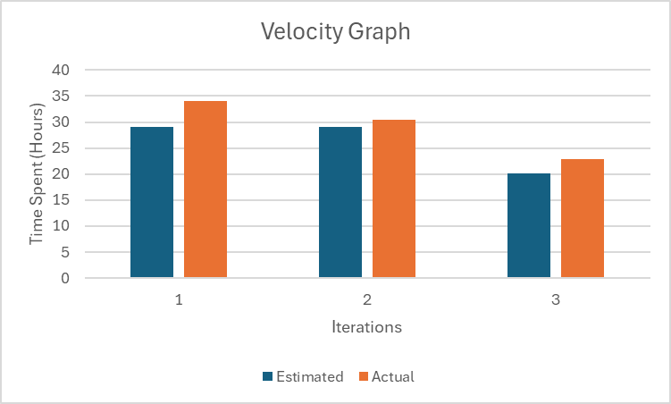

# Project Retrospective: The Learning Journey

## Introduction 
Overall, the Walmarket project was a great success, and the group as a whole worked really well together to accomplish shared goals.
However, during the project's course, we encountered challenges thoroughly testing our application for bugs 
after implementing new features and planning design. Due to time constraints and overconfidence in our coding abilities,
certain features were completed too close to deadlines, leaving insufficient time for comprehensive 
user acceptance testing. Consequently, some critical bugs went unnoticed, leading to suboptimal releases. 
To address these concerns and improve our testing process and decided to meet regularly to discuss about
the design and overall progress.

## What went well
- **Good Teamwork:** Everyone in the team shared ideas and worked together really well. We got better at guessing how long tasks would take us.
- **Learning and Growing:** Even though we were new to using Android Studio, we learned a lot. We worked through challenges together and made an app that we're proud of.

## What Could Be Better
- **Planning Our Time:** We need to get better at managing our time. Sometimes, we tried to do too much at once or didn't plan enough time for testing our work. We completed some features
                         too close to due date leaving us insufficient time for user testing.
- **Understanding Details:** We found out that we need to talk more about the small details of our tasks to make sure we understand them completely. We ended up spending more time than 
                             anticipated on some tasks due to this.
- **Getting Better with Git:** We used Git to manage our code, but we realized we need to learn more about it to avoid problems, like doing the same work twice and merge conflicts.

## Challenges We Faced
- **Being Too Ambitious:** At first, we wanted to do a lot without realizing how much we had to learn. This made some tasks take longer than we thought.
- **Not Defining Things Well:** We talked about what we wanted to do, but we didn't always plan the small, important details. This made some work harder than it needed to be.
- **Underestimating Time:** Sometimes we didn't give ourselves enough time to finish tasks, especially when bugs popped up or some android specific errors.

## Project Velocity

## Looking Forward
We did a lot of things right, like working together and learning new things. But we also learned that we need to plan our time better, talk more about the details of our work, and 
get better at using Git. We're going to keep improving and make our app even better!

