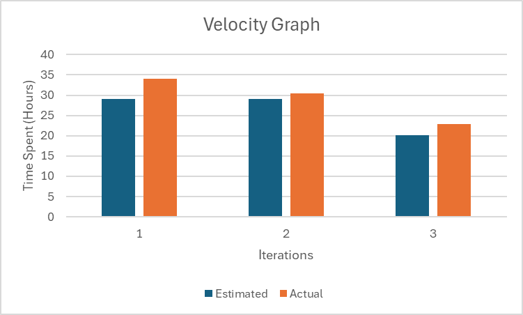

# Iteration3 Worksheet

## What technical debt has been cleaned up
[Commit Link](https://code.cs.umanitoba.ca/comp3350-winter2024/1nnovator2-a01-12/-/commit/5e137a8e6478180ca218ad2455018fd9a520cfda#20a23a590af0253035135e5ccea29480200ab233_62_65)

This commit is the main one paying off the debt we incurred when restricting our application to either the stub or HSQL implementations via a simple commented out line of code. Among other data layer changes, 
we paid this off by adding functionality for the Android Studio Intent to be used to decide which to use at launch, allowing for tests to use either with minimal effort. This was a Reckless and Deliberate type of 
technical debt because we chose to do this because of deadlines and didn’t look to the long-term implications.

## What technical debt did you leave?
We were suggested in the iteration 2 feedback to put all the database column names into a class file with static strings. 
We agree that it is great for maintainability purpose (specially considering the fact we got errors while testing due to mis-spelled 
column name), but we did not get to fix that. We prioritized refactoring integration tests and implementing user login feature than this. 
We thought we could do this near the due date but got busy in writing system tests and making sure our code quality and overall testing is up to a good level. 
This is prudent deliberate type of technical debt. If we were to work on this project in future, this is the first thing we will do.

## Discuss a Feature or User Story that was cut/re-prioritized
We decided to change the priority of user story – See previous orders from medium to low and prioritized testing and refactoring integration tests. Based on feedback from iteration 2, 
we made significant improvements to code quality and conducted comprehensive testing. This was the main reason to re-prioritize this user story.
We implemented new feature of user login in the last iteration. We got to finish the data layer implementation for orders user story and moved the remaining work to future. 

Link to the [user story](https://code.cs.umanitoba.ca/comp3350-winter2024/1nnovator2-a01-12/-/issues/54) 

## System test
One of the system tests created was to test that a user can successfully create a new account. To ensure that this test was not flaky, a temporary data has been started up before the test runs. 
If instead the persistent database was used, the test would only pass once as the first time the account created would be stored in the database and then the next time the test is run, the logic layer 
would recognize that the account had already been made and thus the test would fail. By using the temporary database, the data stored is only kept until the test completes, therefore, the test will pass 
every time even though the account information will be the same. Additionally, the same activity is launched every time the test is run to make sure that the test is run properly, if a different activity 
was run, the instructions written into the test would not be correct as there would be different buttons and fields, leading to failed tests.

Link to [System Test (createAccountTest())](https://code.cs.umanitoba.ca/comp3350-winter2024/1nnovator2-a01-12/-/blob/0.3/app/src/androidTest/java/comp3350/Innovator2/AcceptanceTests/SignInInstrumentedTests.java) 

## System test, untestable
We have included quite a few toast messages in our app, often to indicate to the user if the action they have attempted was successful or not (ex. There are toast messages that tell they user if their attempt to sign 
in was successful or if there was a problem signing them in). It would have been nice to check the exact messages displayed in the toast elements however, it seems that this would involve writing additional classes and possibly 
changing the gradle configuration files. After a few failed attempts at implementing this, it was decided that instead of checking the toast messages to confirm results, we would instead check if the expected activity was shown 
as most of the actions that triggered toast messages are also associated with a changing of activities (ex. If a user attempts to sign in and is unsuccessful the activity stays the same, but if successful the activity will change).

## SOLID
Link to the [Issue](https://code.cs.umanitoba.ca/comp3350-winter2024/twelvegrooves-a02-12/-/issues/79) 

## Velocity/Teamwork

While the ratio of our estimates to our actual time didn’t change much, I would argue that we did improve at our estimation skill as time went on. This is because as we got busier as a group, we were able to scale back on our 
estimates by a proportional amount and maintain a good level of quality within our schedules. Aside from that I think we had a good grasp on our estimations and were able to be successful on this project as a group.

## Learned
One unexpected lesson from this project was the realization that overconfidence in our coding abilities and time management could lead to underestimation of the complexity of tasks, 
especially when encountering platform-specific bugs. Despite our initial confidence and great planning, we discovered that some tasks which appeared simple took significantly more 
time due to unforeseen issues, which most of the time were simple things once we got more comfortable with Android studio. This experience not only highlighted the challenges of working 
with new technology but also taught us the importance of factoring in extra time for potential obstacles. As we progressed, we got better at using android studio, estimating time, managing 
expectations. As a result, we had more time to comprehensively test our code and focus on code quality.